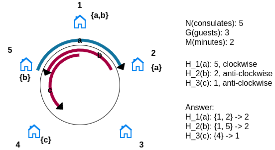

# Round D 2019
 * X or What? (TBD)
 * Latest Guests
 * Food Stalls (TBD)

## Latest Guests
 * [Kickstart Source](https://codingcompetitions.withgoogle.com/kickstart/round/0000000000051061/0000000000161427)

### Problem
Find the numbers of consulates that remember each guest.
 * Consulates remember only last guests
 * Each guest moves clockwise or anti-clockwise for every minute

### Approach 1 for Test set 1
Think backwards
 * Let *t* be the time
 * Then, the *i*-th guest located in `(H[i] + t) % N` if the guest moves clockwise.
 * Simulate the location of guest from `t = m` to `t = 0` or `t = (m - N)`

### Approach 2 for Test set 2
Grouping guests by final location and direction